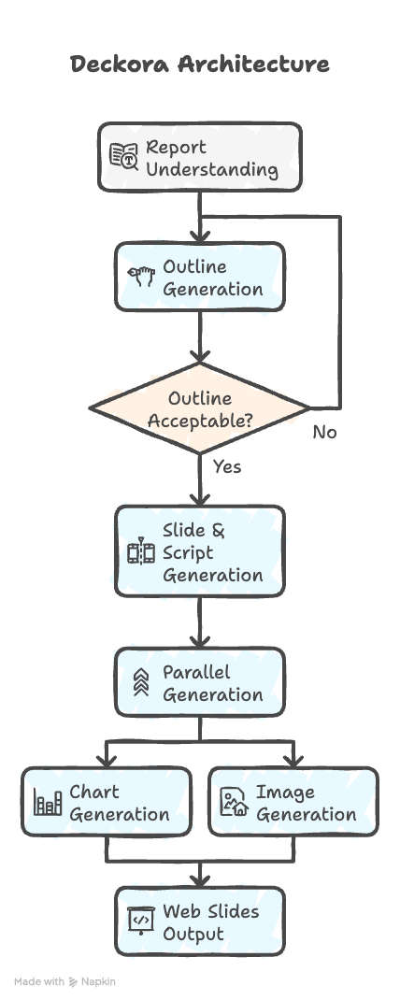

# Deckora: Automated Presentation Generation

A multi-agent system that automatically generates professional presentations with slides and scripts from documents, reports, and research papers using Google's Agent Development Kit (ADK).

---

## Problem

Creating presentation materials is a time-consuming and repetitive task that prevents people from focusing on high-value work. Whether you're a student who spent weeks writing a research report and now needs to present it, or an enterprise team that needs to create dozens of presentations for internal meetings, client pitches, and external communications - the process is the same:

- Extracting key information from source documents
- Structuring content into a logical, engaging flow
- Designing slides with appropriate visuals and layouts
- Writing presentation scripts with proper timing and transitions
- Ensuring quality, coherence, and professional appearance

This process can take hours or even days, especially for technical or complex content. **Deckora** automates this entire workflow, generating presentation-ready slides and scripts that are perfect enough to use without further modification.

**Why this matters:**
- **Free Human Time**: Enables individuals and teams to focus on high-value tasks like analysis, strategy, and decision-making instead of slide creation
- **Enterprise Scale**: Handles the volume of presentations needed in corporate environments (internal updates, client pitches, board presentations, training materials)
- **Individual Productivity**: Helps students, researchers, and professionals quickly transform their written work into compelling presentations
- **Quality Consistency**: Ensures uniform quality and professional formatting across all presentations
- **Expert-Level Output**: Generates slides that are polished and complete - no need for extensive editing or redesign

**Target Customers:**
- **Enterprise Teams**: Business analysts, sales teams, technical teams, executive assistants who need to create many presentations regularly
- **Individuals**: Students preparing academic presentations, researchers presenting findings, professionals creating pitch decks

**Competitive Advantage**: While similar products exist, Deckora aims to be the expert in this space - generating slides that are perfect enough that humans don't need to further modify them, saving maximum time and effort.

---

## Solution

Deckora is a multi-agent system that automates the entire presentation generation workflow from research reports to polished slides and scripts. The system uses a sequential pipeline of specialized AI agents, each optimized for a specific task, working together to transform raw documents into presentation-ready materials.

### How It Works

Deckora transforms research documents into presentation-ready materials through a **specialized multi-agent pipeline**. Each agent focuses on a specific task—from understanding the document structure to generating polished slides—with built-in quality evaluation that automatically improves outputs when needed. The system intelligently extracts only relevant content per slide to optimize efficiency, while parallel processing handles visual assets simultaneously for faster generation. The final output is a web-ready HTML presentation that can be viewed in a Next.js frontend application or integrated into existing workflows.

### Why Agents?

Generating a good presentation isn't one task—it's many different steps: understanding the document, structuring a story, designing slides, and writing a script. Agents are a natural fit because:

- **Break a complex workflow into expert subtasks**: Each step can be handled by a specialized agent that focuses on one job
- **Improve quality with specialized reasoning**: Specialized agents produce better results than a single general-purpose model
- **Enable automatic checking and self-correction**: Agents evaluate each other's outputs, so the system can catch mistakes and improve quality automatically
- **Scale reliably from one document to hundreds**: The multi-agent workflow makes Deckora more accurate, more consistent, and capable of scaling to many documents

This multi-agent approach directly addresses the core challenges of presentation generation: formatting, structuring, consistency, and scale—delivering expert-level results automatically.

### Key Technical Approach

**Specialized Multi-Agent Architecture**: Five specialized agents, each optimized for a specific task (knowledge extraction, outline generation, quality evaluation, content creation, visualization), work together in a coordinated pipeline. This specialization enables better results than a single general-purpose model.

**Quality Assurance with Automatic Retry**: The system uses a stronger model (Gemini 2.5 Flash) for evaluation, automatically regenerating content when quality is unacceptable. This ensures high-quality outputs without human intervention.

**Efficiency Optimizations**: Selective context extraction reduces token usage by including only relevant report sections per slide (maintaining 70%+ coverage), while parallel processing handles charts and images simultaneously.

**Production-Ready Design**: Full observability, error handling, and state management enable reliable deployment to Google Cloud Run with extensibility for future enhancements.

---

## Architecture



### Pipeline Flow

The system uses a sequential multi-agent architecture with quality gates, feedback loops, and parallel processing. The complete flow is as follows:

**Step 1: Report Understanding (Sequential)**
- **Agent**: `ReportUnderstandingAgent` (uses Gemini 2.5 Flash Lite)
- **Tool**: `load_pdf` utility function (loads PDF from URL or file)
- **Process**: 
  - Loads PDF content from URL or file
  - Extracts structured knowledge (sections, key takeaways, figures, audience profile)
  - Infers scenario and target audience if not provided
- **Output**: `report_knowledge.json` stored in session state

**Step 2: Outline Generation with Evaluation Loop (Sequential with Conditional Retry)**
- **Agent 1**: `OutlineGeneratorAgent` (uses Gemini 2.5 Flash Lite)
  - Generates presentation outline from report knowledge
  - Creates slide breakdown with timing and content notes
- **Agent 2**: `OutlineCriticAgent` (uses Gemini 2.5 Flash - stronger model for evaluation)
  - Evaluates outline quality (completeness, coherence, relevance, accuracy)
  - Returns quality score, acceptability flag, strengths, weaknesses, recommendations
- **Loop Logic**: 
  - If outline is acceptable (`is_acceptable == True`): Continue to next step
  - If outline is not acceptable (`is_acceptable == False`): **RETRY LOOP** (max 1 retry)
    - Passes previous outline + critic feedback to `OutlineGeneratorAgent`
    - Regenerates outline with improvements
    - Re-evaluates the retried outline
- **Output**: `presentation_outline.json`, `outline_review.json` stored in session state

**Step 3: Slide and Script Generation (Sequential)**
- **Agent**: `SlideAndScriptGeneratorAgent` (uses Gemini 2.5 Flash Lite)
- **Process**:
  - Uses selective context extraction (only relevant report sections per slide)
  - Generates detailed slide content with design specifications
  - Generates presentation script with timing and transitions
- **Output**: `slide_deck.json`, `presentation_script.json` stored in session state

**Step 4: Parallel Chart and Image Generation (Parallel Processing)**
- **Parallel Execution**: Chart generation and image pre-generation run simultaneously
- **Agent**: `ChartGeneratorAgent` (uses Gemini 2.5 Flash Lite)
  - Generates data visualizations for slides requiring charts
  - Uses `generate_chart_tool` (Plotly + Kaleido)
- **Tool**: `pre_generate_images` (from `generate_web_slides_tool`)
  - Pre-generates images for all image keywords in slide deck
  - Uses `generate_image` tool (Gemini or Stability AI)
- **Process**: Both tasks execute in parallel using `asyncio.gather()`
- **Output**: Chart images embedded in `slide_deck`, image cache for web slides

**Step 5: Web Slides Generation (Tool-based)**
- **Tool**: `generate_web_slides_tool`
- **Process**: 
  - Converts slide deck to HTML presentation
  - Embeds generated charts and images
  - Creates frontend-ready JSON format
- **Output**: `slides_data.json` (for frontend integration), `web_slides_result.json`

### Key Components

**Agents (5+ specialized agents):**
- **ReportUnderstandingAgent**: Extracts structured knowledge from PDFs, identifies key sections, figures, and takeaways
- **OutlineGeneratorAgent**: Creates logical presentation structure with slide breakdown and timing
- **OutlineCriticAgent**: Evaluates outline quality (completeness, coherence, relevance) with retry logic
- **SlideAndScriptGeneratorAgent**: Generates detailed slide content and presentation script with timing
- **ChartGeneratorAgent**: Creates data visualizations using Plotly for slides requiring charts

**Tools:**
- `load_pdf_from_url_tool`: Loads and extracts text from PDF URLs
- `generate_chart_tool`: Generates charts using Plotly and Kaleido
- `generate_web_slides_tool`: Converts slide deck to HTML presentation
- `generate_image`: Generates images using Gemini or Stability AI

**Core Services:**
- **PipelineOrchestrator**: Coordinates agent execution and manages pipeline flow
- **AgentExecutor**: Handles agent execution with error handling and retry logic
- **SerializationService**: Efficient JSON serialization with caching
- **ObservabilityLogger**: Tracks agent execution, metrics, and trace history

### Technology Stack

- **Framework**: Google ADK (Agent Development Kit)
- **LLM Models**: 
  - Gemini 2.5 Flash Lite (for generation agents)
  - Gemini 2.5 Flash (for evaluation agent - stronger model for better judgment)
- **Tools**: Plotly (charts), Kaleido (image export), pypdf (PDF parsing)
- **Deployment**: Google Cloud Run with GitHub Actions CI/CD
- **Frontend**: Next.js web application for presentation viewing

---

## Instructions for Setup

### Prerequisites

- Python 3.9+
- Google API Key (for Gemini models)
- (Optional) Google Cloud credentials for deployment

### Setup

1. **Clone the repository**
```bash
git clone https://github.com/tszkwaan/deckora_lite
cd deckora-lite
```

2. **Install dependencies**
```bash
python -m pip install -r requirements.txt
```

3. **Set API Key**
```bash
export GOOGLE_API_KEY='your-api-key-here'
```

Or create a `.env` file:
```
GOOGLE_API_KEY=your-api-key-here
```

4. **Verify installation**
```bash
python main.py
```

---

## Usage

### Basic Usage

Edit `main.py` to configure your presentation:

```python
from config import PresentationConfig
from presentation_agent.core.pipeline_orchestrator import PipelineOrchestrator

config = PresentationConfig(
    scenario="academic_teaching",  # Options: "academic_teaching", "business_pitch", "technical_demo"
    duration="10 minutes",
    target_audience="Master students",  # Optional - will be inferred if not provided
    custom_instruction="",  # Optional custom instructions
    report_url="https://arxiv.org/pdf/2312.14197",  # PDF URL or provide report_content directly
    style_images=[],  # Optional: List of image URLs for style extraction
)

orchestrator = PipelineOrchestrator(
    config=config,
    output_dir="presentation_agent/output",
    save_intermediate=True,
)

outputs = await orchestrator.run()
```

### Configuration Options

- **scenario**: Presentation type (academic_teaching, business_pitch, technical_demo)
- **duration**: Target presentation length (e.g., "10 minutes", "20 minutes")
- **target_audience**: Audience level (students, C-level, colleagues, non-technical)
- **custom_instruction**: Specific requirements (e.g., "include detailed methodology", "focus on practical applications")
- **report_url**: URL to PDF document
- **report_content**: Alternative to report_url - provide raw text content

### Output Files

Generated files are saved in `presentation_agent/output/`:

- `report_knowledge.json` - Structured knowledge extracted from report
- `presentation_outline.json` - Presentation outline with slide breakdown
- `outline_review.json` - Quality evaluation results
- `slide_deck.json` - Generated slide content with design specifications
- `presentation_script.json` - Presentation script with timing and transitions
- `slides_data.json` - Frontend-ready JSON for web presentation
- `observability.log` - Structured execution logs
- `trace_history.json` - Complete execution trace

### Interactive Development (ADK-web)

For interactive development and debugging:

1. **Start ADK API Server** (in one terminal):
```bash
adk api_server --allow_origins=http://localhost:4200 --host=0.0.0.0
```

2. **Start ADK-web** (in another terminal):
```bash
cd .project_internal/adk-web
npm run serve --backend=http://localhost:8000
```

3. **Open browser**: Go to `http://localhost:4200` and select `presentation_agent` from the dropdown

---

## Deployment

The system is deployed to **Google Cloud Run** with automated CI/CD via GitHub Actions.

### Deployment Architecture

- **Container**: Docker containerization
- **CI/CD**: GitHub Actions workflow
- **API**: REST API endpoints (`GET /health`, `POST /generate`)
- **Secrets**: Environment variables via Google Secret Manager

### API Endpoints

**Health Check:**
```bash
curl https://YOUR_SERVICE_URL/health
```

**Generate Presentation:**
```bash
curl -X POST https://YOUR_SERVICE_URL/generate \
  -H "Content-Type: application/json" \
  -d '{
    "report_url": "https://arxiv.org/pdf/2312.14197",
    "scenario": "academic_teaching",
    "duration": "10 minutes",
    "target_audience": "students"
  }'
```

### Deployment Documentation

See [presentation_agent/deployment/DEPLOYMENT.md](presentation_agent/deployment/DEPLOYMENT.md) for detailed deployment instructions.

---

## Project Structure

```
deckora-lite/
├── presentation_agent/
│   ├── agent.py                    # Root agent (for ADK-web compatibility)
│   ├── agents/                     # Agent implementations
│   │   ├── report_understanding_agent/
│   │   ├── outline_generator_agent/
│   │   ├── outline_critic_agent/   # Evaluation agent with retry logic
│   │   ├── slide_and_script_generator_agent/
│   │   └── chart_generator_agent/
│   ├── core/                       # Core services
│   │   ├── pipeline_orchestrator.py
│   │   ├── agent_executor.py
│   │   ├── agent_registry.py
│   │   └── ...
│   ├── tools/                      # Custom tools
│   │   ├── web_slides_generator/   # Web slides generation
│   │   │   ├── __init__.py
│   │   │   ├── image_collection.py    # Image keyword collection & pre-generation
│   │   │   ├── slide_generation.py     # Slide HTML fragment generation
│   │   │   ├── frontend_data.py        # Frontend JSON data generation
│   │   │   ├── css_generation.py       # CSS and styling
│   │   │   └── utils.py                # Theme colors and utilities
│   │   ├── chart_generator_tool.py
│   │   └── image_generator_tool.py
│   ├── utils/                      # Utility functions
│   │   ├── template_helpers/       # Template rendering helpers
│   │   │   ├── __init__.py
│   │   │   ├── comparison.py          # Comparison sections & grids
│   │   │   ├── tables.py               # Data table rendering
│   │   │   ├── diagrams.py             # Flowcharts, workflows, process flows
│   │   │   ├── icons.py                # Icon-related components
│   │   │   ├── slides.py               # Slide layouts (cover, fancy content/charts)
│   │   │   └── utils.py                # Shared utilities (markdown, number highlighting)
│   │   ├── template_loader.py
│   │   ├── image_helper.py
│   │   └── ...
│   ├── deployment/                 # Deployment configuration
│   └── output/                     # Generated outputs
├── deckora_frontend/               # Next.js frontend application
│   ├── app/                        # Next.js app directory
│   ├── components/                # React components
│   └── ...
├── config.py                       # Configuration
├── main.py                         # Main execution script
└── requirements.txt                # Dependencies
```

---

## Key Concepts Demonstrated

This project demonstrates **7 out of 8** key ADK concepts:

### Multi-agent System ✅
- **Agent powered by an LLM**: All agents use `LlmAgent` with Gemini models (2.5 Flash Lite for generation, 2.5 Flash for evaluation)
- **Sequential agents**: Pipeline with 5+ specialized agents executed sequentially (ReportUnderstandingAgent → OutlineGeneratorAgent → OutlineCriticAgent → SlideAndScriptGeneratorAgent → ChartGeneratorAgent)
- **Loop agents**: Retry logic with OutlineGeneratorAgent and OutlineCriticAgent feedback loop (max 1 retry when outline quality is unacceptable)

### Tools ✅
- **Custom tools**: 4+ custom tools (PDF loader, chart generator, web slides generator, image generator)

### Sessions & Memory ✅
- **Sessions & state management**: Uses `InMemorySessionService` via `session.state` for agent coordination and intermediate result storage (report_knowledge, presentation_outline, slide_deck, etc.)

### Context Engineering ✅
- **Custom implementation**: Selective context extraction via `ContextBuilder` class - extracts only relevant report sections per slide while maintaining 70%+ coverage for accuracy

### Observability ✅
- **Logging**: Structured logging via ObservabilityLogger (saved to `observability.log`)
- **Tracing**: Complete execution trace history (saved to `trace_history.json`)
- **Metrics**: Agent execution metrics displayed in console at pipeline completion:
  - Total agents executed, successful/failed/retried counts
  - Success rates (calculated via `get_success_rate()`)
  - Timing data (per-agent `duration_seconds` and total pipeline duration)
  - Metrics also saved to `trace_history.json` and logged to `observability.log`
- **ADK-web UI**: Interactive development and debugging interface for agent testing and visualization (setup instructions in Usage section)

### Agent Evaluation ✅
- **Full evaluation framework**: OutlineCriticAgent evaluates outline quality (completeness, coherence, relevance, accuracy) with automatic retry logic and feedback loop

### Agent Deployment ✅
- **Cloud Run deployment**: Deployed to Google Cloud Run with GitHub Actions CI/CD

### Not Implemented
- ❌ **A2A Protocol**

---

## Examples

### Student Use Case: Academic Presentation

A student has spent weeks writing a research report and now needs to present it:

```python
config = PresentationConfig(
    scenario="academic_teaching",
    duration="10 minutes",
    target_audience="Master students",
    report_url="https://arxiv.org/pdf/2312.14197",  # Or path to their report PDF
)
```

Deckora generates a complete presentation with slides and script, ready to present without modification.

### Enterprise Use Case: Business Pitch

A sales team needs to create a pitch deck from market research:

```python
config = PresentationConfig(
    scenario="business_pitch",
    duration="15 minutes",
    target_audience="C-level",
    custom_instruction="Focus on ROI and business impact",
    report_url="https://example.com/market-research.pdf",
)
```

Deckora creates a professional pitch deck that can be used directly in client meetings.

### Enterprise Use Case: Internal Updates

A technical team needs to present project findings to stakeholders:

```python
config = PresentationConfig(
    scenario="technical_demo",
    duration="20 minutes",
    target_audience="colleagues",
    report_url="path/to/technical-report.pdf",
)
```

Deckora generates presentation materials for internal team meetings, saving hours of preparation time.
